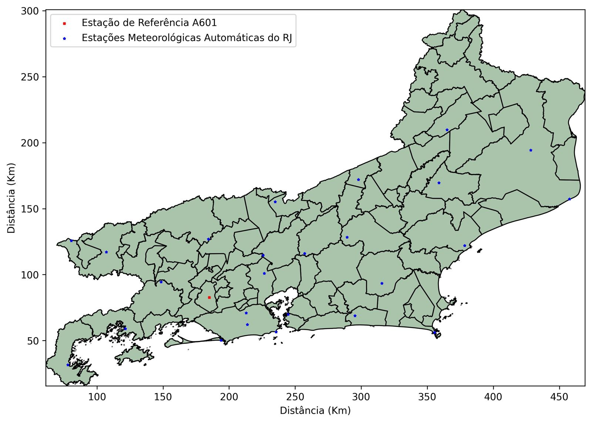
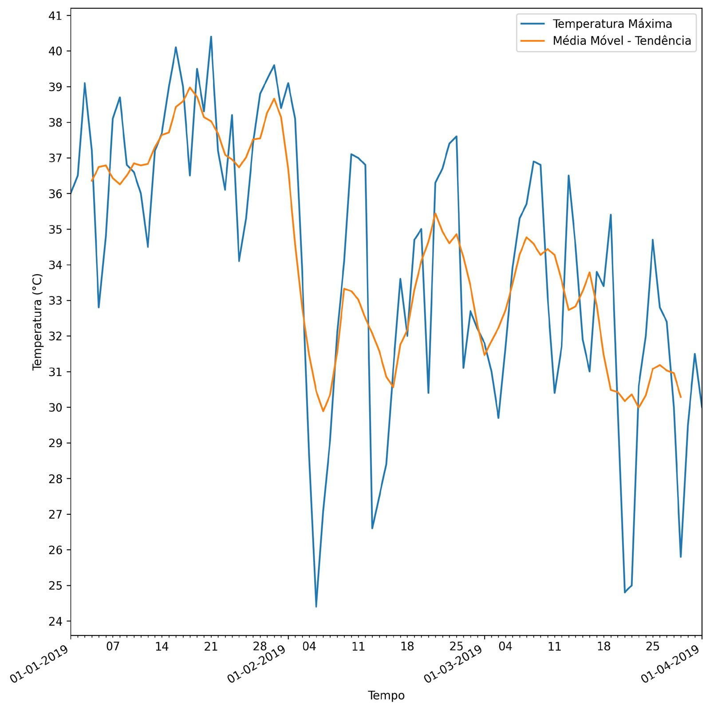

# CLIMATERBOT
Uma aplicação no Telegram para visualização de variáveis climáticas e séries temporais

O Climaterbot foi criado como meu Trabalho de Conclusão de Curso na pós-graduação Residência em Práticas Agrícolas e Assistência Técnica e Extensão Rural da Universidade Federal Fluminense.

## Demonstração do Bot

  

#### Mapa da demonstração

  

#### Gráfico da demonstração

  

#### Teste o Climaterbot!
Basta procurar por CLIMATER no aplicativo do Telegram ou acessar o link: https://t.me/CLIMATERBOT

## Objetivos
Desenvolver um programa classificado como robô, chamado popularmente pelo termo bot, para o aplicativo de comunicação Telegram, servindo de interface para viabilizar a visualização e interpretação de variáveis climáticas, médias e séries temporais, através da requisição e armazenamento de dados climáticos.

### Objetivos específicos
Para que o bot Climater apresente funcionalidade e aplicabilidade nesse contexto, os seguintes objetivos deverão ser desenvolvidos e entregues:
1. Criar funções para captura de dados meteorológicos das estações automáticas do INMET através de sua API
2. Georreferenciar as estações automáticas do estado do Rio de Janeiro
3. Georreferenciar as sedes dos municípios do estado do Rio de Janeiro
4. Desenvolver função para conversão de CEP para coordenada geográfica de referência, integrando diversas APIs
5. Desenvolver função para converter de Coordenadas Geográficas Grau Minuto Segundo para Grau Decimal, facilitando cálculos e conversões internas
6. Elaborar mapas exibindo as estações meteorológicas e pontos de interesse do usuário
7. Calcular distância entre as estações meteorológica e pontos de interesse do usuário com intuito de oferecer dados relevantes
8. Criar funções para facilitar a interpretação de dados climáticos dentro do aplicativo do Telegram, por exemplo, um mecanismo de tendência
9. Disponibilizar código aberto em repositório público e instruções para a implantação da aplicação

## Justificativa
Compreende-se que as informações agroclimáticas disponibilizadas atualmente nos meios informatizados no contexto nacional não oferecem interfaces de fácil e ágil acesso, criando a necessidade do desenvolvimento de novas soluções capazes de universalizar o seu acesso e interpretação. Tais pontos se agravam com limitações tecnológicas e financeiras, vividas por pequenos produtores, não dispondo de adequações voltadas para sistemas móveis, como celulares no geral, e dessa maneira a aplicação elaborada neste trabalho apresenta-se como uma proposta para democratizar o acesso de dados agroclimáticos.

## Python e bibliotecas usadas
Todo o código da aplicação do bot foi escrito em **Python 3.7**. Além disso, para atender certos aspectos e funções do projeto, usou-se as seguintes bibliotecas: 
- Aiogram
- BeautifulSoup4
- GeoPandas
- Geopy
- Matplotlib
- Pandas
- PyCEP_Correios
- Requests

### Dados Climáticos
Foram obtidas do INMET as seguintes informações: base da dados diários das estações automáticas do Rio de Janeiro, compreendo o período mínimo, que se inicia em 2017, até o último dia disponível no BDMET até a finalização do código da aplicação, ou seja, dia 31 de agosto de 2022.

Os dados climáticos são provenientes da base de dados do INMET, contemplando as seguintes variáveis:
 - Temperatura Máxima (°C)
 - Temperatura Média (°C)
 - Temperatura Mínima (°C)
 - Chuva Total no Dia (mm)
 - Umidade Relativa do Ar Média Diária (%)
 - Umidade Relativa do Ar Mínima Diária (%)
 - Velocidade do Vento Média Diária (m/s)
 
Os dados apresentados pelo bot apresentam falhas provinientes da coleta de dados realizada pelo INMET, resultado de falha e interrupção de funcionamento das estações automáticas.

Para elaboração desse projeto optamos por ofertar dados do INMET desde o ano de 2017, sendo apenas limitados pela data inicial de operação de cada uma das estações, configurando séries temporais até 31 de agosto de 2022.

### Mecanismo de tendência - Média Móvel Simples
A tendência pode representar a melhora ou piora gradual de um determinado dado. Nos gráficos climáticos empregamos uma média móvel simples, que considera 7 dias para seu cálculo, servindo como um mecanismo de tendência, facilitando a compreensão da dinâmica da variável climática explorada.

### Métodos para obtenção de dados climáticos
#### Estação Meteorológica 
Será necessário informar o código de uma estação meteorológica automática do Rio de Janeiro mantida pelo INMET. As estações atualmente inseridas no projeto são: A601, A602, A603, A604, A606, A607, A608, A609, A610, A611, A618, A619, A620, A621, A624, A625, A626, A627, A628, A629, A630, A635, A636, A652, A659, A667.

#### Coordenadas Geográficas - Latitude Longitude 
Será necesário informar as coordenadas geográficas do ponto através da latitude e longitude, no formato Grau-Minuto-Segundo ou Grau-Decimal.
É importante ressaltar que coordenadas que apontem pontos fora do Rio de Janeiro serão consideradas inválidas.

#### Converter CEP para Coordenadas 
Será necessário informar um CEP e essa informação será convertida numa coordenada geofráfica de referência.
É importatnte ressaltar que não funciona para todos os CEPs, por limitações das APIs usadas no projeto, atendendo apenas a faixa de CEPs do Rio de Janeiro.

#### Usar Município como Ponto de Referência 
Será necessário informar o nome de um município do Rio de Janeiro. Com isso teremos a sede do município como ponto georreferenciado.

#### Como fazer para criar uma cópia funcional do CLIMATER?
- Clonar o repositório: **git clone https://github.com/dan-alvares/CLIMATERBOT.git**
- Caso não tenha o git instalado, basta baixar o projeto [aqui](https://github.com/dan-alvares/CLIMATERBOT/archive/refs/heads/main.zip)
- Edite e insira o token no arquivo config.py entre as aspas da variável declarada neste arquivo. Este token é obtido através do BotFather dentro do Telegram ao criar um novo bot (é gratuito)
- Instalar as dependências do projeto com comando **pip install -r requirements. txt**
- Por fim, basta rodar o bot através da linha de comando usando o comando **python climater_bot.py**

### Agradecimentos
Agradeço meus mestres da UFF, por transmitirem seu conhecimento e se fazerem presentes no amadurecimento deste projeto, principalmente meu
orientador, Marcio Cataldi, me possibilitando enorme desenvolvimento profissional.

Agradeço a Universidade Federal Fluminense, Fundação Euclides da Cunha, Ministério da Agricultura, Pecuária e Abastecimento e Secretaria de
Agricultura Familiar e Cooperativismo.